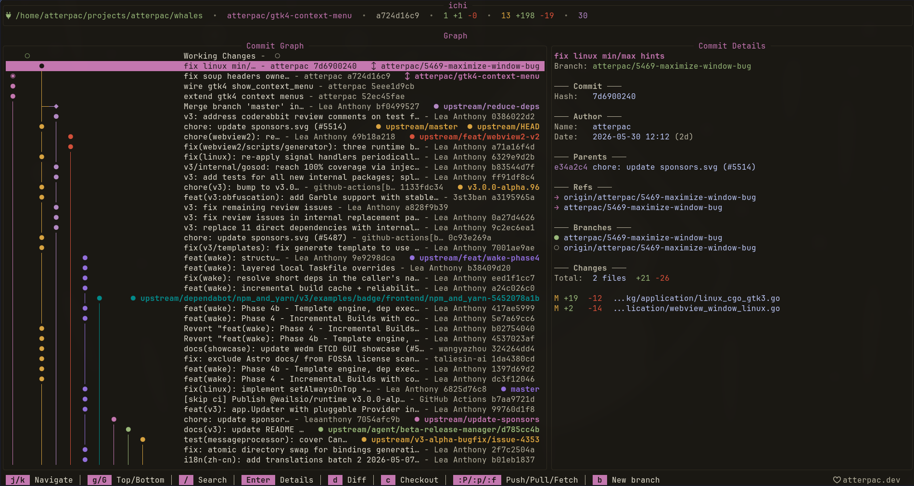

<div align="center">

# ichi

**A keyboard-driven Git client for the terminal.**

Browse history, stage, commit, branch, sync, and manage pull requests — without leaving your shell.

[Documentation](https://ichi.atterpac.dev) · [Installation](#installation) · [Keybindings](#keybindings)



</div>

---

**ichi** puts the parts of Git you reach for every day — the commit graph, staging,
committing, branching, syncing, stashing, conflict resolution, and pull requests —
behind a fast, consistent, vim-flavored interface. Move with <kbd>j</kbd>/<kbd>k</kbd>,
act with a single key, and drop into a `:` command line when you want the full Git verb.

## Features

- **Commit graph** — a live view of your history; inspect any commit's diff in place.
- **Interactive staging** — stage and unstage by file, by hunk, or line by line.
- **Branches** — create, check out, merge, and rebase.
- **Syncing** — push, pull, and fetch from remotes.
- **Stash** — save work in progress and apply, pop, or drop entries.
- **Conflict resolution** — a dedicated three-way view for resolving merges.
- **Pull requests** — list, read, and review GitHub PRs without tabbing out.
- **Diff & blame** — full-file diffs and line-by-line blame.
- **Command palette & `:` command line** — run any Git action from one keystroke.
- **26 built-in themes** — including Catppuccin, Gruvbox, Tokyo Night, Nord, and more.

## Installation

ichi is a single Go binary. You'll need [Go 1.25+](https://go.dev/dl/) and `git`
on your `PATH`.

```sh
go install github.com/atterpac/ichi/cmd/ichi@latest
```

Make sure `$(go env GOPATH)/bin` is on your `PATH`. Or build from source:

```sh
git clone https://github.com/atterpac/ichi
cd ichi
go build -o ichi ./cmd/ichi
```

## Usage

From inside any Git repository:

```sh
ichi
```

| Flag | Default | Description |
|---|---|---|
| `-path` | `.` | Path to the Git repository to open |
| `-no-splash` | `false` | Skip the splash screen |
| `-version` | | Print version and exit |

GitHub pull request features use the [`gh` CLI](https://cli.github.com/) — run
`gh auth login` so ichi can read your repository's PRs.

## Keybindings

The everyday loop:

| Key | Action |
|---|---|
| <kbd>g</kbd> | Commit graph (home) |
| <kbd>s</kbd> | Status |
| <kbd>b</kbd> | Branches |
| <kbd>S</kbd> | Stashes |
| <kbd>p</kbd> | Pull requests |
| <kbd>Space</kbd> | Stage / unstage selected file |
| <kbd>c</kbd> | Commit |
| <kbd>:</kbd> | Command line |
| <kbd>Ctrl</kbd>+<kbd>P</kbd> | Command palette |
| <kbd>T</kbd> | Theme selector |
| <kbd>?</kbd> | Help |
| <kbd>Esc</kbd> | Go back |
| <kbd>q</kbd> | Quit |

See the full [Keybindings & Commands](https://ichi.atterpac.dev/guides/keybindings/) reference.

## Built on dado

ichi is written in Go on top of [dado](https://dado.atterpac.dev), a terminal UI
component library — that's where it gets its themeable look, smooth navigation,
and color schemes.

## Why the name ichi?

I spent a week trying to think of the _right_ name that didnt clash with the sea of other git
clients out there, ultimately I decided while this is a git client its _my_ git client and I 
don't need a direct tie to git or popular naming conventions. So i went with something personal
`Shinichi` is the name my of cat, i often call him `ichi` for short. Adds a small amount of joy
when i type it in the terminal 


<img src="assets/shinichi.png" alt="my cat shinichi"
